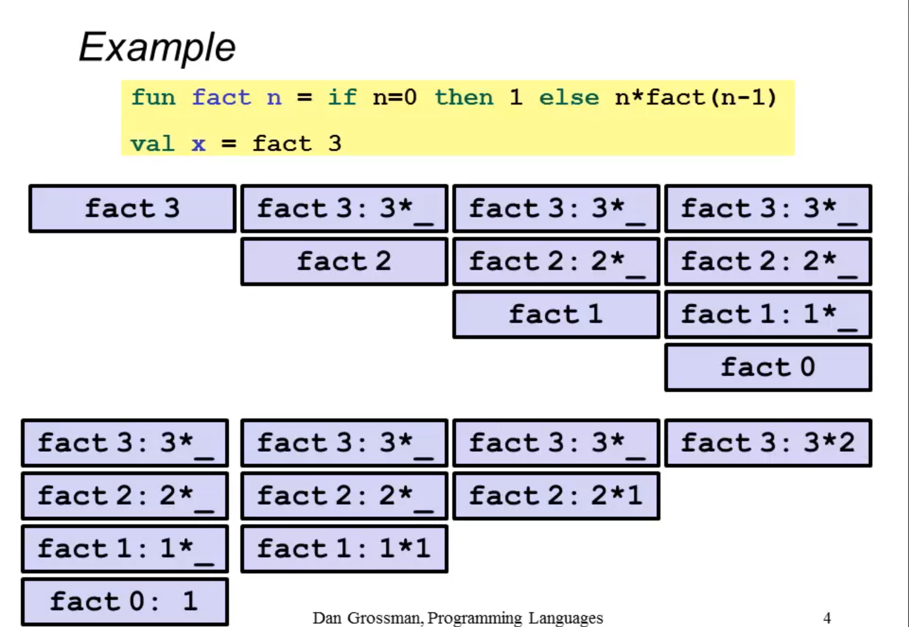
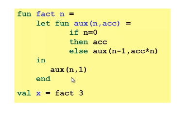
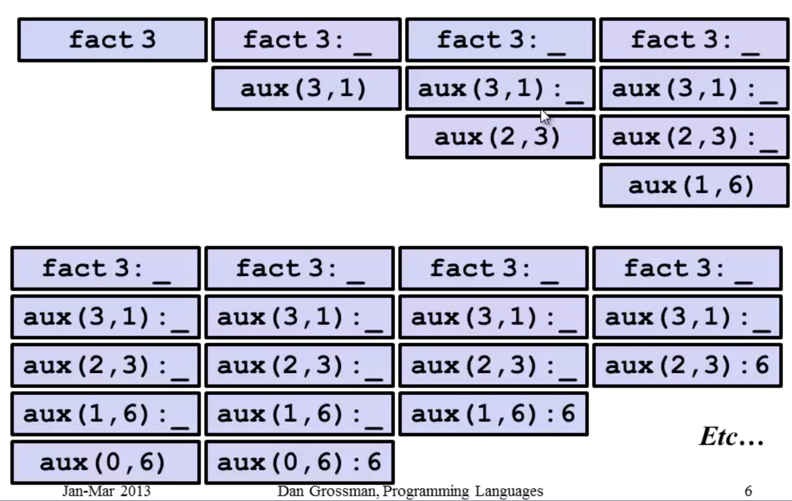
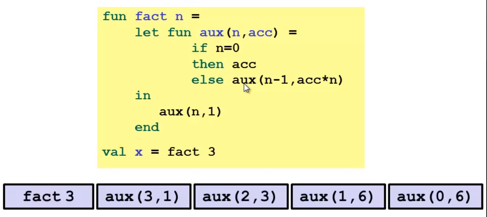

# Recursion

Recursion is basically calling the same function many times to solve a problem.

It's the same thing that a loop, but sometimes is easier to implement. Like in factorials, sorting algorithms like quickSort, mergeSort, ...

Its major problem is: **call stack**, recursion generally uses call stacks a lot, which can lead to stack overflow. Classical example:

This leads to a lot of memory inside of our call stack.
Obs.: a function in the call stack, is only removed when it is returned.

Benchmark test (after build release): 
- Factorial of 20
- Times ran 2_000_000_000
- Time taken: 10.088s

Benchmark test (before build release): 
- Factorial of 20
- Times ran 500_000_000
- Time taken: 35.641s

### Tail Recursion

It's a special kind of recursion, where the recursive call is the very last thing in the function. So its return is teh function return.
To do it, usually we use an accumulator in our recursion function. Like the example of Professor Dan Grossman:

You might think it's the same of the classical recursion, but the call stack is fully with only return functions, that in some compilers are all interpreted as only 1 function call, with some optimizations (almost all functional languages have these optimizations). Examples: 
- Scheme
- Haskell
- ..

And then the running time will be the same if we used a loop, no call stack fill.
What really happens:

Benchmark test (after build release): 
- Factorial of 20
- Times ran 2_000_000_000
- Time taken: 9.483s

Benchmark test (before build release): 
- Factorial of 20
- Times ran 500_000_000
- Time taken: 32.070s

There was some improvement at running time, but it was not relevant, the mainly part is to not use calls stack, avoiding stack overflow.

### References
- [Coursera University of Washington class](https://www.coursera.org/lecture/programming-languages/tail-recursion-YZic1)
- [Quora Tikhon Jelvis comment](https://www.quora.com/What-is-tail-recursion-Why-is-it-so-bad)
